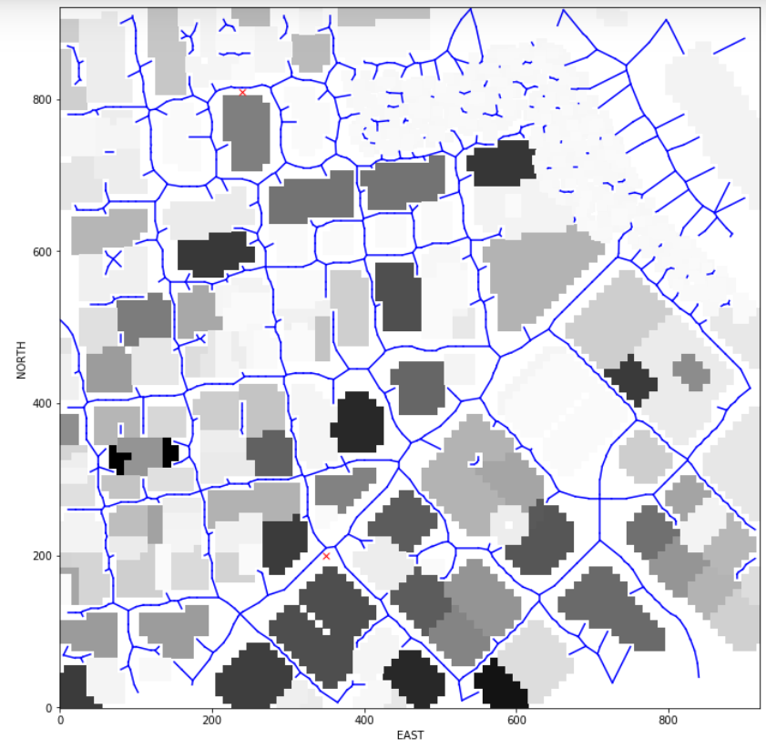

# Project: 3D Motion Planning

In this project, an algorithm is developed to set the drone's global position in a given map, and navigate it through the map with obstacles (buildings) from random start to goal positions.

## Usage:

1. Activate 'fcnd' under miniconda cmd prompt.
2. Navigate to project folder.
3. Run `python graph_generator.py` (to pre-generate graphs with connected dots)
4. Run `python motion_planning_voronoi_3D.py`

---

## [Rubric](https://review.udacity.com/#!/rubrics/1534/view) Points
### Here I will consider the rubric points individually and describe how I addressed each point in my implementation.  


### Explain the Starter Code

#### 1. Explain the functionality of what's provided in `motion_planning.py` and `planning_utils.py`

When MotionPlanning class is initiated, __init__ starts to register necessary callback functions.  'state_callback' is the high level function which switches the drone's state from manual to arming, planning, and disarming.  'local_position_callback' sets target locations from one waypoint to the next, and transitions to landing state if waypoints are done.

When ‘plan_path’ is called under 'state_callback', it first reads 'colliders'csv' file which includes obstacles' locations and dimensions.  The data is then passed to an external function call 'create_grid' from 'planning_utils.py' to generate a 2D map (array) describes the x and y locations of the obstacles.  it then reads drone's global position from GPS, and it is converted to drone's local coordinates.  The coordinates are set as the start.  For the goal position, it is simply an offset in both x and y directions.  Both start and goal locations are then fed into a-star algorithm to find a path.  The a-star in starter code only allows x and y direction movements.  As a result, the paths linking waypoints show up as zigzag shape.


### Implementing Your Path Planning Algorithm

#### 1. Set your global home position
Here is how global home position is implemented:

```python
filename = 'colliders.csv'
data = np.genfromtxt(filename, delimiter=',', dtype='str', max_rows=1)
lat0 = float(data[0].split(' ')[-1])
lon0 = float(data[1].split(' ')[-1])
self.set_home_position(lon0, lat0, 0.0)
```

#### 2. Set your current local position
I wrote a function to convert global positions to location positions relative to global home.
```python
def global_to_map(self, global_pos, current_pos, shape, n_offset, e_offset, altitude):
    position = global_to_local(global_pos, self.global_home)
    # quick check if the global position falls outside of given map.  
    # If it falls outside, set the position to current drone position
    if position[0] < n_offset or position[0] >= shape[0] or position[1] < e_offset or position[1] >= shape[1]:
        position = global_to_local(current_pos, self.global_home)
    return (int(position[0]) - n_offset, int(position[1]) - e_offset, altitude)
```

#### 3. Set grid start position from local position
The function above takes care of this.

#### 4. Set grid goal position from geodetic coords
An array (lon, lat) can be manually input as variable GOAL_COORD.  Function ‘global_to_map’ will convert it to location position.  Currently manual input for goal position is commented out because I am using random goal positions instead.
Here is the implementation.
```python
def random_goal(grid, x_min, x_max, y_min, y_max):
	x = np.random.randint(x_min, x_max)
	y = np.random.randint(y_min, y_max)
	z_min = grid[x, y] + 1
	z_max = z_min + 5
	z = np.random.randint(z_min, z_max)
	return (x, y, z)
```

#### 5. Modify A* to include diagonal motion (or replace A* altogether)
I chose to modify A* to search through graph instead of grid.  The cost in the graph only considers length between any two connected nodes.  Elevation change does not have add-on cost, nor does direction change.

#### 5.1 Graph Generation and Path Search Algorithm
I've tested probabilistic roadmap, medial axis, and Voronoi graph on the project, and I've come upt with a hybrid solution.  For initial graph generation, Voronoi is used because it seems to get most of the pathways connected.  It also makes sense that these graphs can be generated well before the drones are flying.  The static obstacles don't change overnight.  When new buildings are being erected, a new graph can be downloaded to the drones before they take flight.  With this rationale, a separate python file 'graph_generator.py' takes care of the graph.  The graph is first generated based on obstacles at the ground level with a safety distance of 5 meters in x, y, and z directions, and then copied and pasted on itself with 10 meters interval (vertical).  There are 22 levels since the tallest building on the map is 212 meters.  Nodes that are directly vertical to another are connected for A* search purpose.  The graph is then saved to a file.  A good chunk of time can actually be taken to manually generate a very good graph for real world applications.
```python
nx.write_gpickle(G, "map.gpickle")
```
Below is a visualization of the map with graph.  The obstacles have different shades of grey because they are set to the actual height of the obstacles from the csv file with safety distance.

When the drone is running 'plan_path', it reads the gpickle file and the graph is instantly loaded.  When start and goal are defined, the points may not be on the nodes of the loaded graph, so a function called 'closest_point' finds the closest nodes for start and goal.

The approximate start and goals are fed into modified A* to search through graph instead of grid.  With the given graph and locations of start/goal, a path may not be found with A* for a few reasons.
1. The closest node to start/goal may not be connected to the majority of the paths.  See graph above and some paths are closed off.
2. Start/goal may be on top of an obstacle.  This may confuse the drone.

To reduce the chance of having no path, a local probabilistic roadmap is generated around start/goal locations.  A* -> local probabilistic roadmap process is repeated for 3 times maximum if A* cannot find a path to goal.  If there is no path, an empty list is sent to the drone so it will simply take off and land.  If there is a path, a function 'prune_path' will simplify the path while not running into any obstacles.  The simplified path now contains all necessary waypoints to get the drone from start to goal.

Next, a heading is assigned to each waypoint based on the direction between this and the next waypoints.  With a specific heading, the drone is always pointing its front at the next waypoint (light green rotor on the left, and bright red rotor on the right).


#### 6. Cull waypoints 
As mentioned above, ‘prune_path’ function is implemented to simplify the path. The function takes two nodes and check if the straight path between them will collide with any obstacle.  If the path does collide, no nodes are removed, and the next set of nodes are checked.  If the path does not collide, the waypoint that is closer to the goal is removed, and the path between this and next nodes are checked.  To check for collision, a modified version of Bresenham is utilized.  The original version is not conservative enough so I've modified the code to include all grid cells that the path touch.

Below shows an example of unpruned (left) and pruned (right) path.


Below is the link to the video of a number of consecutive runs where the drone flies to a random goal position, and takes off from where it lands and flies to another random goal position.

<a href="http://www.youtube.com/watch?feature=player_embedded&v=XfbJDfuBjxE
" target="_blank"></a>

From the video, the drone takes off from where it landed, and goes through the path finding algorithm with A*, prune the path (simplification), and follows the waypoints to the goal.  If A* cannot find a path, it is because either or both start/goal positions have disconnected nodes.  When it happens, random nodes are generated around start/goal and edges are connected to ensure A* can find a path.

When elevation changes in the list of waypoints, it seems the drone control cannot satisfy x, y, z positions at the same time.  It is likely the embedded (default) control separates vertical position from x, y positions.

#### 7. Obstacle Map File

By flying the drone many times with random goals, I found the drone sometimes the path leads into some certain buildings or the paths are interfering with the edges of buildings.  I dug deeper and found quite a few mistakes in the colliders.csv file that the x, y coordinates of some buildings are off, and some building heights are severely underestimated.  
I corrected the building heights that I ran into problem with, while having sufficient x, y safety distance.  The included colliders.csv is updated.

## Future Development

Function to replan if an unexpected obstacles or events occur that will force the drone to detour or it crashes.
